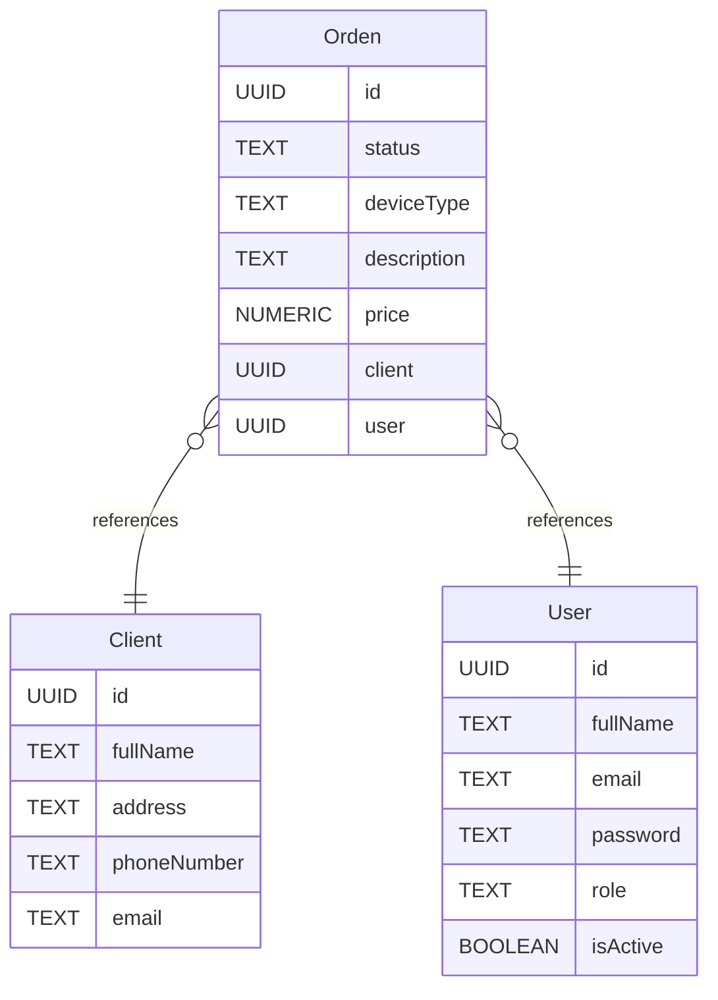

<p align="center">
  <a href="http://nestjs.com/" target="blank"></a>
</p>


# Backend Conecta-Rh 

## Proceso de despligue en local

### Programas y Tecnologias requeridas
1. [Instalar Nodejs](https://nodejs.org/es/)
2. [Instalar Docker Desktop](https://www.docker.com/products/docker-desktop/)
3. [Instalar TablePlus](https://tableplus.com/) (En su defecto instalar algun gestor de base de datos que soporte postgres)
4. [Instalar postman](https://www.postman.com/) (En su defecto instalar alguna aplicacion que te permita consumir endpoints)

## Base de datos

## Tipo de base de datos

- **Sistema de base de datos:** PostgreSQL
## Estrucuturas de tablas

### Orden

| Name        | Type          | Settings                      | References                    | Note                           |
|-------------|---------------|-------------------------------|-------------------------------|--------------------------------|
| **id** | UUID | 🔑 PK, not null, unique |  | |
| **status** | TEXT | not null |  | |
| **deviceType** | TEXT | not null |  | |
| **description** | TEXT | not null |  | |
| **price** | NUMERIC | not null |  | |
| **client** | UUID | not null | fk_Mercancia_id_cliente_cliente | |
| **user** | UUID | not null | fk_Mercancia_id_usuario_Usuario | | 


### User

| Name        | Type          | Settings                      | References                    | Note                           |
|-------------|---------------|-------------------------------|-------------------------------|--------------------------------|
| **id** | UUID | 🔑 PK, not null, unique |  | |
| **fullName** | TEXT | not null |  | |
| **email** | TEXT | not null |  | |
| **password** | TEXT | not null |  | |
| **role** | TEXT | not null |  | |
| **isActive** | BOOLEAN | not null, default: true |  | | 


### Client

| Name        | Type          | Settings                      | References                    | Note                           |
|-------------|---------------|-------------------------------|-------------------------------|--------------------------------|
| **id** | UUID | 🔑 PK, not null, unique |  | |
| **fullName** | TEXT | not null |  | |
| **address** | TEXT | not null |  | |
| **phoneNumber** | TEXT | not null |  | |
| **email** | TEXT | null |  | | 


## Relaciones

- **Orden to Client**: many_to_one
- **Orden to User**: many_to_one

## Diagrama de base de datos



### Configuracion de entorno de trabajo
1. Clonar el siguiente repositorio
```
https://github.com/MartinArreguinMolina/conecta-rh
```
2. Cambiar el nombre del archivo .env.template a ```.env```
3. Ejecutar el siguiente comando 
```
docker-compose up
```
4. Verificar que en tu Docker Desktop tengas un contenedor con el 
nombre de tu base de datos

5. Abre tu cmd o powershell de windows, navega hacia la carpeta donde clonaste tu 
repositorio y ejecuta el siguiente comando 
```
yarn start:dev
```
verifica que no tengas ningun error

### Consumir EndPoints
1. Abre postman y llena la base de datos con el siguiente link

- Peticion GET
```
localhost:3000/api/seed
```
2. Para consumir los demas endpoints clonar el siguiente repositorio y exportar en Postman
```

```